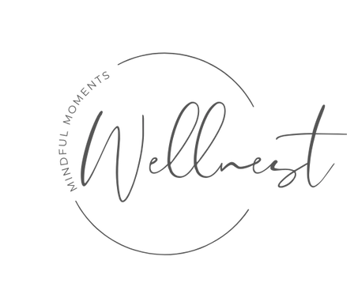
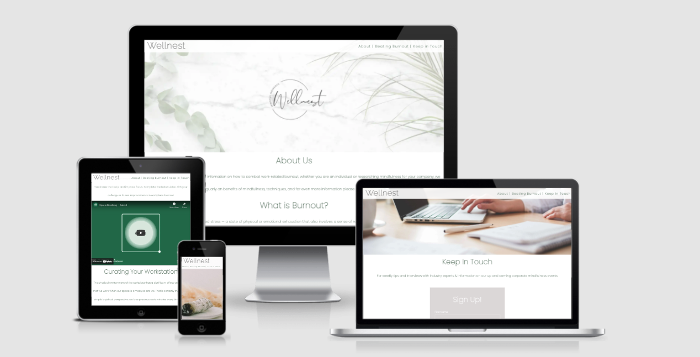
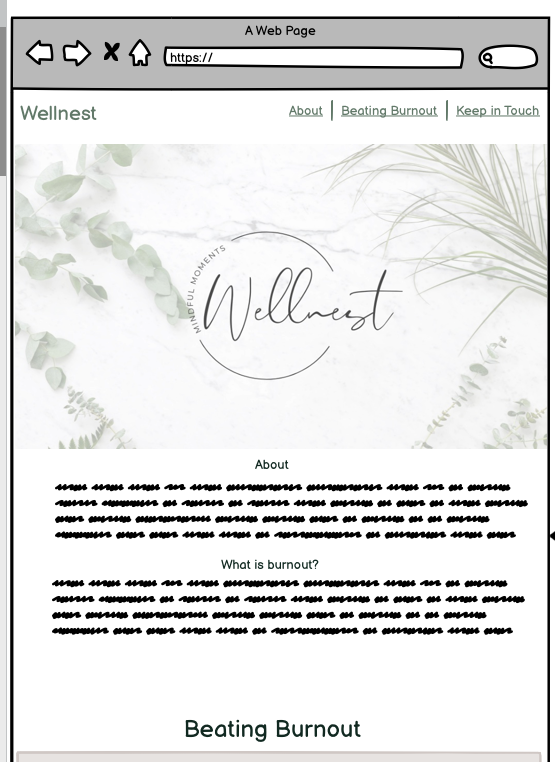
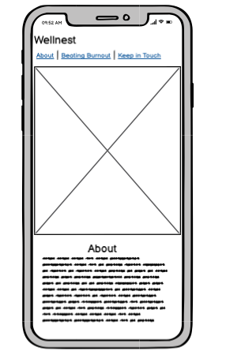

# Wellnest #

Welcome to Wellnest . A website developed as a source of information for companies and professionals seeking assistance in avoiding workplace burnout. 
Wellnest arranges corporate wellness events and also provide knowledge to empower employees and companies to implement workplace mindfulness. 

## UX ##

As this is an expansive topic, I have chosen to keep the content light in order to point the end user to join the mailing list, that way the company have a pool to advertise to regularly through their newsletter. 

## User Stories ##

- As a User I want to easily find tips and tricks to beat workplace burnout
- As a user I want to find out where I can book a corporate wellness Event for my company
- As a user I want to gain information about how workplace burnout can happen. 
- As a user I want to share this information readily with my colleagues
- As an organisation I want to provide useable information
- As an organisation I want to gain a sizeable list to advertise our services to potential clients
- As an organisation I want to gain social media followers to advertise our services to potential clients

## Wireframing ##

Following the advise of my mentor Marcel I redeveloped the wireframe to commence a mobile first approach. 

Basic wireframes were created using Balsamiq Cloud. I went a little further almost to mockup level to help visualise the development needed. Having the skeleton in place focused subsequent coding.

This was a learning curve as i then moved from a one page navigation to separate landing pages, as the content felt too sparse, and didn’t work based on my current skillset. 

## Colour Scheme ##

The colour scheme was devised from a pinterest board in which I collated in advance of the project commencement, the site is aimed at a corporate audience so it needed to be clean, easily read and not too “out-there”. 

## Header Logo & Navigation ##

While the company logo was developed for an aesthetic reason, a secondary logo was created for readability in the navigation bar. 

The header is fixed on all devices to allow ease of navigation, the navigation section moves from underneath to the right when via mobile, hover affects are also utilised to aid in user navigation. 

## About Page ##

The landing page has a hero background of eucalyptus faded out slightly with the logo placed in the centre keeping in theme with I love ucaplptus pinterst theme.  This image is to covey a clean and calm space to the user. 

## Footer ##

The footer is an important element as the company wishes to gain social media following, this was placed on every page and set out in a clear format with logos

## Testing ##

### HTML Validator ###

### CSS Validator ###

### Lighthouse ###

### Browsers ###

## Fixed Bugs ##

## Deployment ##
The site was deployed to GitHub pages. The steps to deploy are as follows:
In the GitHub repository, navigate to the Settings tab
From the source section drop-down menu, select the Master Branch
Once the master branch has been selected, the page will be automatically refreshed with a detailed ribbon display to indicate the successful deployment.
The live link can be found here  

## Credits ##

## Media ##

- Home page hero image -  Photo by Edward Jenner from Pexels
- Overlaying logo was made using Canva.  
- Exercise section background image Photo by Mikhail Nilov from Pexels.
- The background desktop download image - Photo by Manuela Adler from Pexels.
- Curating workstation image - Photo by cottonbro from Pexels

## video ##
Square Breathing – Guided by UAB Student Affairs
