# Wellnest #

Welcome to Wellnest . A website developed as a source of information for companies and professionals seeking assistance in avoiding workplace burnout.  
Wellnest arranges corporate wellness events and also provide knowledge to empower employees and companies to implement workplace mindfulness.  
The client has previously gained business through  social media alone and now wants a professional space to point their potential customers to, in order to drive leads. 

# Table of Contents #
1. Website Design Considerations
    - Client Needs
    - User Stories
    - Colour Scheme & Font
2. Wireframes
    - Mobile
    - Desktop
3. Features
   -  Inital Deployment Features
   -  Future Features
4. Technologies Used
5. Testing
    - Automated Testing
    - Client feature expectation testing
    - User Stories / Expectations
6. Deployment
7. Credits

# Site Design Considerations #

## Client Needs ##

As this is an expansive topic, the client has chosen to keep the content light in order to point the user to their main call to action, join their mailing list. The basic functions that the client wants are as follows:
 - A way to sign up to their newsletter.
 - Content in which they can update frequently.
 - Usefull information that can updated frequently on easy to implement solutions. 
 - details of how to get in touch and where their office is based.
 - Links to their social media to gain following. 

## User Stories ##

- As a User I want to easily find tips and tricks to beat workplace burnout
- As a user I want to find out where I can book a corporate wellness Event for my company
- As a user I want to gain information about how workplace burnout can happen. 
- As a user I want to share this information readily with my colleagues
- As an organisation I want to provide useable information
- As an organisation I want to gain a sizeable list to advertise our services to potential clients
- As an organisation I want to gain social media followers to advertise our services to potential clients.

## Colour Scheme ##

The colour scheme was devised from a eucalyptus-inspired colour palate , the site is aimed at a corporate audience so it needed to be clean, easily read and not too “out-there”.  

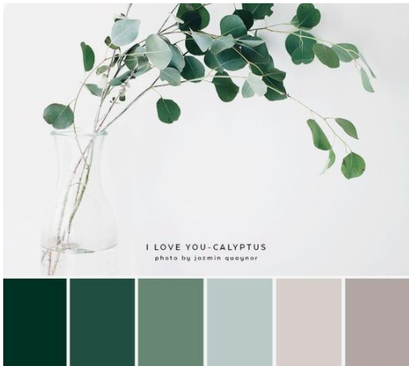

## Fonts ##

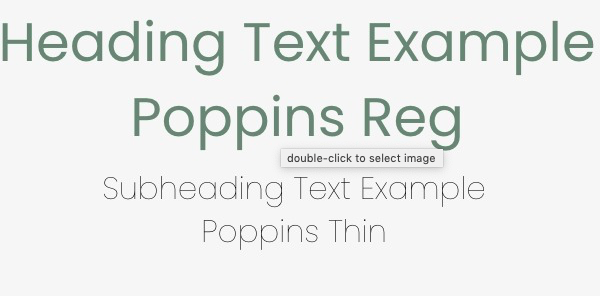

Throught the page Poppins is used, its has a light softer appearance but has a corporate feel to it, which I thought suited the project.   
- Font sourced from Google fonts as stated in the content section.  

# Wireframes #

# Mobile #
  

The webpage was developed in a mobile first approach. 

# Desktop #

  

Basic wireframes were created using Balsamiq Cloud.  
The client wanted to push the wire frame slightly further to include some imagery and colour, lalmost to mockup level to help visualise the development needed.  

# Features #

## Header Logo & Navigation ##

While the company logo was developed for an aesthetic reason, a secondary logo was created for readability in the navigation bar. 

The header is fixed on all devices to allow ease of navigation, the navigation section moves from underneath to the right when via mobile, hover affects are also utilised to aid in user navigation. 

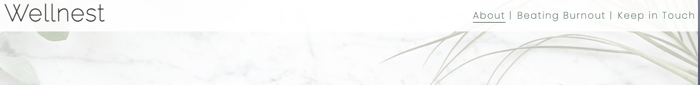

## About Page ##

The landing page has a hero background of eucalyptus faded out slightly with the logo placed in the centre keeping in theme with I love ucaplptus pinterst theme.  This image is to covey a clean and calm space to the user. 

## Keep in Touch Page ##

The most important page, as it creates a well of leads for the Wellnest company, it allows weekly content to be pushed to its target market. 
The end user fills out their details to opt in. 

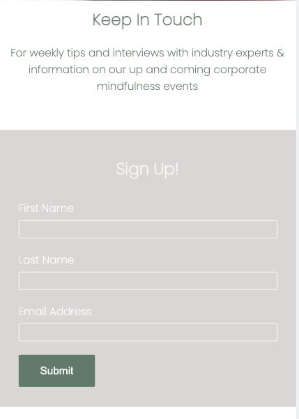

## Beating Burnout Page ##

This page gives tips and tricks for easy to implement ways to combat burnout, including an easy to follow video. 

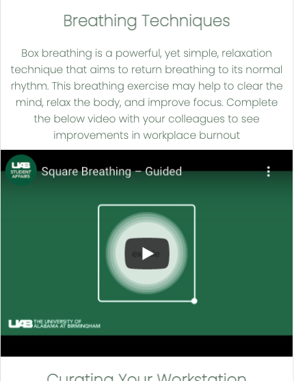

And an even easier to implement, downloadable desktop background

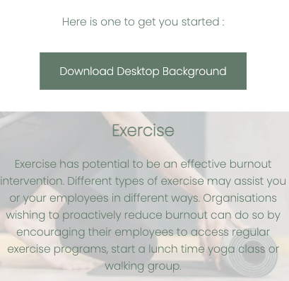

## Footer ##

The footer is an important element as the company wishes to gain social media following, this was placed on every page and set out in a clear format with logos

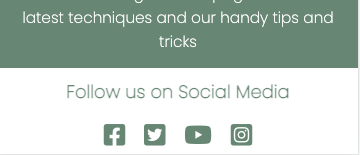

# Technologies Used #

# Testing #

## Manual Testing ##

I tested each element of the site as outlined below:  

The Home Page  

- Tested the 

### Browsers ###

I have tested the webpage on Chrome, Internet Explorer, Safari and Firefox and all have given good performance. 

# Automated Testing #

### HTML Validator ###

I tested the site via dropping in the code to the [W3C Markup Validation Service](https://validator.w3.org), it returned with two errors

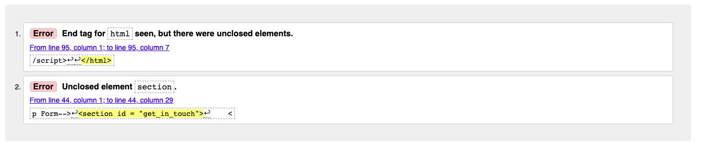

Thankfully with easy solutions, to close the open elements.
Once these were closed the the site passed with no errors. 

### CSS Validator ###
I tested the style.css via dropping the code into [Jigsaw.w3.org](https://jigsaw.w3.org/css-validator/validator.html.en)

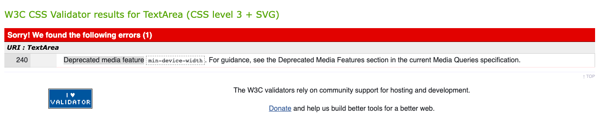

I removed the word device from the min-device-width , which fixed the error and caused no issues with the code, and was tested again and passed with no errors. 

### Lighthouse ###

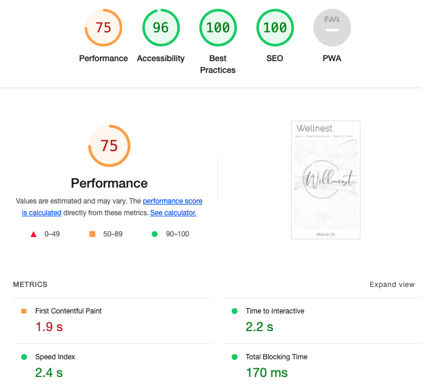

Initally I had very large images present on all pages, this affected performance greatly, initally I changed them to webp from .jpeg /.png , as suggested by lighthouse, but this did not improve the result at all, then I resized all images with Tinypng - which increased the performance greatly.

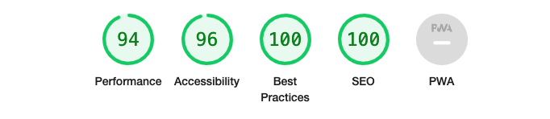

## Fixed Bugs ##

Aside from the issues stated above. In the beating burnout page the section below was not acting as it should, the image was covering the header afecting the aestheics of the page. 

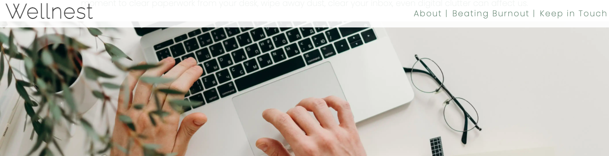

This was fixed by removing an accidental additonal attribute.

# Deployment #
The site was deployed to GitHub pages. The steps to deploy are as follows:  
- In the GitHub repository, navigate to the Settings tab  
- From the source section drop-down menu, select the Main Branch  
- Once the ,ain branch has been selected, the page will be automatically refreshed with a detailed ribbon display to indicate the successful deployment.  
- The live link can be found [here](https://leannel89.github.io/project_1/)  

# Credit #

## Content ##

- The icons on the footer were taken from [Font Awesome](https://fontawesome.com/).
- Fonts were sourced from [Google Fonts](https://fonts.google.com)
- Content on work related burnout was taken from [Mayoclinic.org](https://www.mayoclinic.org/healthy-lifestyle/adult-health/in-depth/burnout/art-20046642)
- Beating burnout tips were taken from [Luxafor.com](https://luxafor.com/)
- Curating your workspace was taken from [Bond University](https://research.bond.edu.au/en/publications/the-case-for-finally-cleaning-your-desk)
- Exercise facts were taken from https://pubmed.ncbi.nlm.nih.gov/25870778/ 
- The Eucalyptus-inspired color palatte was taken from [Akula Kreative at akulakreative.com](https://akulakreative.com/blog/2017/3/a-eucalyptus-inspired-color-palette)

## Media ##

- Home page hero image -  [Photo by Edward Jenner from Pexels](https://www.pexels.com/photo/green-plant-covered-with-snow-4250573/)
- Overlaying logo was made using [Canva](https://www.canva.com).  
- Exercise section background image [Photo by Mikhail Nilov from Pexels.](https://www.pexels.com/photo/woman-in-black-leggings-unrolling-a-yoga-mat-6740754/)
- The background desktop download image - [Photo by Manuela Adler from Pexels.](https://leannel89-project1-orml8qbyhyq.ws-eu38.gitpod.io/)
- Curating workstation image - [Photo by cottonbro from Pexels](https://www.pexels.com/photo/person-in-beige-long-sleeve-shirt-using-macbook-pro-4065876/)

## Video ##
Square Breathing – Guided by [UAB Student Affairs](https://www.youtube.com/channel/UCikiUwDAVxi-n4FsBwe8DnA) on Youtube. 
